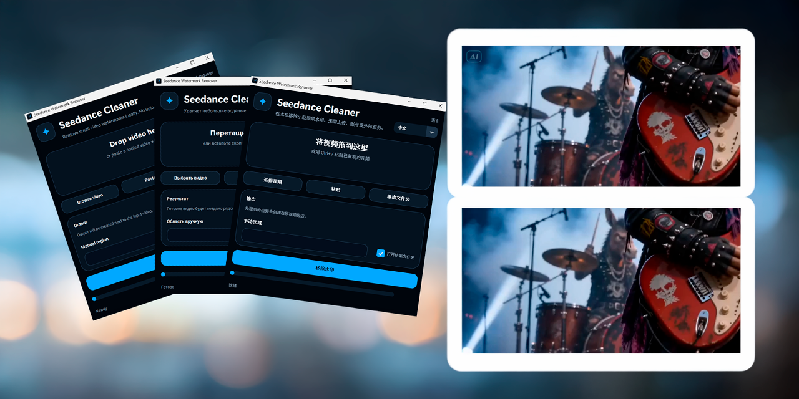

# Seedance Watermark Remover

<p align="center">
  
</p>

<div align="center">

**Offline Windows app for removing small static corner watermarks locally.**

[](https://github.com/bakhtiersizhaev/seedance-watermark-remover/releases/latest/download/SeedanceWatermarkRemover-Windows-x64-portable.zip)
[](https://bakhtiersizhaev.github.io/seedance-watermark-remover/)
[](https://github.com/bakhtiersizhaev/seedance-watermark-remover/releases/latest)

**Language:** [English](https://bakhtiersizhaev.github.io/seedance-watermark-remover/) · [Русский](https://bakhtiersizhaev.github.io/seedance-watermark-remover/ru.html) · [中文](https://bakhtiersizhaev.github.io/seedance-watermark-remover/zh.html)

</div>

---

**Remove small static corner watermarks from videos locally on Windows.**

Seedance Watermark Remover is a lightweight open-source desktop app by **Baktier Sizhaev**. It helps when you have a video with a small corner badge, text label, logo overlay, or an **"AI生成" / AI-Generated** mark and you want a clean copy without sending the file to an online editor.

The app runs on your computer, keeps the original video untouched, and creates a new MP4 output. It uses OpenCV inpainting for practical local cleanup. It is built for small static marks in video corners, not for heavy video restoration or removing large moving objects.

> Windows portable ZIP • local video watermark remover • OpenCV inpainting • CPU-only • no account required

---

## When This Tool Helps

Use it if your real problem sounds like one of these:

- “I need to remove a small watermark from a video without uploading it.”
- “I have an MP4 with an AI-generated label in the corner.”
- “I want a Windows video watermark remover that works offline.”
- “I need to clean a logo or text overlay from the corner of a clip.”
- “I want a portable app, not a complicated Python setup.”

It is useful for creators, editors, testers, and developers who need a quick local pass on generated clips, draft videos, review files, or exported MP4s.

---

## Download the Windows App

For most Windows users, use the ready-built portable release asset:

[Download SeedanceWatermarkRemover-Windows-x64-portable.zip](https://github.com/bakhtiersizhaev/seedance-watermark-remover/releases/latest/download/SeedanceWatermarkRemover-Windows-x64-portable.zip)

You can also open the [latest GitHub Release](https://github.com/bakhtiersizhaev/seedance-watermark-remover/releases/latest) if you want checksums or release notes. Extract the ZIP first, open the extracted `SeedanceWatermarkRemover` folder, and run:

```text
SeedanceWatermarkRemover.exe
```

Do not run the EXE directly from inside the ZIP. Keep the EXE together with the `_internal` folder. The portable build already includes the runtime files, OpenCV, CustomTkinter UI files, TkinterDnD support files, app assets, and ffmpeg.

### Windows SmartScreen notice

Windows may show **"Windows protected your PC"** because this is a new unsigned open-source desktop app. The current release is not code-signed yet, so Windows displays **Publisher: Unknown publisher**.

This warning is about Windows reputation and code signing, not a confirmed virus finding. The source code, build script, and release checks are public. If you trust this release, click **More info → Run anyway**. You can also verify the downloaded file with SHA256 before running it.

```text
4dbb2a47b6272bceb7d8abe9e9aaa320b77a6af1a8fa646f467f5646ae41c7f3  SeedanceWatermarkRemover-Windows-x64-portable.zip
e502c2a86a7d5fb4cd9507d8c44cba8803dbaaa90172a7648d8327ed9123b267  SeedanceWatermarkRemover/SeedanceWatermarkRemover.exe
```

For a future larger public release, the right next step is to buy an OV/EV code-signing certificate and sign `SeedanceWatermarkRemover.exe` so Windows shows a verified publisher instead of Unknown publisher.

---

## What It Does

- Detects likely small static marks in video corners.
- Removes corner text, badges, or simple logo overlays with OpenCV TELEA inpainting.
- Works with portrait and landscape videos.
- Lets you set a manual `x,y,width,height` region when auto-detection is not enough.
- Leaves the source video unchanged and writes a separate clean output file.
- Preserves audio where possible during final MP4 reassembly.
- Provides a minimal desktop UI with drag-and-drop, clipboard paste, progress, and logs.

---

## What It Does Not Do

- It does not upload your video.
- It does not require an account, subscription, or access credentials.
- It does not edit the original source file in place.
- It does not guarantee perfect results for large, moving, transparent, or center-screen marks.
- It does not claim affiliation with any video generation provider.

---

## How It Works

1. **Samples frames** so static corner text stays visible while moving content becomes less important.
2. **Scores corner regions** using edge density and temporal stability.
3. **Builds a focused mask** around the likely watermark strokes.
4. **Inpaints each frame locally** with OpenCV TELEA on CPU.
5. **Reassembles the video** with ffmpeg and keeps audio where possible.

If automatic detection picks the wrong area, use the manual region field in the desktop app or the `-r x,y,w,h` command-line option.

---

## Desktop App Flow

1. Drop a video into the window, paste a copied video file, or choose one with **Browse video**.
2. Leave the manual region empty for auto-detect, or enter `x,y,w,h` if you already know the area.
3. Click **Remove watermark**.
4. Wait for the progress bar.
5. Open the output folder and check the new clean MP4.

The interface uses CustomTkinter to keep the Windows app lightweight while still feeling modern.

---

## What to Know Before Using It

This is a practical cleanup tool, not a promise of perfect restoration. You will usually get the best result when the mark is small, static, and close to a corner. If the mark moves, covers faces or objects, sits in the center, or changes across frames, a manual video editor may still be the better option.

The manual region option exists for the common case where you know exactly what part of the frame should be cleaned but automatic detection chooses a nearby object instead.


## Logo and Visual Assets

The project uses an original app mark and reproducible assets:

- SVG source for the icon;
- PNG sizes for app and site use;
- Windows ICO for the packaged EXE;
- a Python asset generator for repeatable builds.

No third-party branding is used in the logo.

---

## GitHub Pages Site

A static GitHub Pages site is prepared in three languages:

- English
- Russian
- Chinese

Recommended Pages setting: publish from the `docs/` folder on the default branch.

---

## Recommended GitHub Repository Metadata

Repository description:

```text
Offline Windows desktop app for removing small static corner watermarks from videos with OpenCV inpainting.
```

Recommended GitHub topics:

```text
seedance
seedance-watermark-remover
watermark-remover
video-watermark-remover
video-processing
opencv
opencv-python
inpainting
python
customtkinter
pyinstaller
ffmpeg
windows
windows-app
desktop-app
portable-app
offline-tool
cpu-only
open-source
```

These are repository topics. Set them in the GitHub repository settings after the repository is created.

---

## Source Installation

Developers can run the source version with Python:

```bash
python -m pip install -r requirements.txt
```

You also need ffmpeg available on your system path when running from source.

---

## Command-Line Usage

```bash
# Auto-detect a small static corner watermark
python watermark_remover.py input.mp4

# Save to a custom output path
python watermark_remover.py input.mp4 -o clean.mp4

# Use a manual region if auto-detection fails: x,y,width,height
python watermark_remover.py input.mp4 -r 10,5,120,60
```

---

## Options

| Flag | Description |
|------|-------------|
| `input` | Path to input video |
| `-o`, `--output` | Output file path, default: `<input>_clean.mp4` |
| `-r`, `--region` | Manual watermark region `x,y,w,h`; skips auto-detection |

---

## Common Questions

### Will this work on every watermark?

No. It is designed for small static corner marks. Large moving marks, center-screen marks, or complex transparent overlays may need manual editing.

### Does it change my original video?

No. The app writes a new output file and leaves the source video untouched.

### Does it need a GPU?

No. The current release uses CPU-only OpenCV inpainting.

### Why is the Windows download a ZIP instead of one EXE?

The EXE needs bundled runtime files, OpenCV, UI assets, and ffmpeg. A one-folder portable ZIP is more reliable for this kind of desktop tool.

---

## Development Checks

For review-ready changes, run:

```bash
python -m pip install -r requirements.txt -r requirements-dev.txt
python -m ruff format build_exe.py seedance_gui.py watermark_remover.py test_seedance_gui.py scripts/generate_assets.py
python -m ruff check .
python -m unittest -v
python seedance_gui.py --self-test
python seedance_gui.py --smoke-process
```

To build and validate the portable Windows release ZIP:

```bash
python build_exe.py
```

The build script verifies the source app, packaged EXE, release folder, release ZIP, and extracted ZIP smoke path.

---

## Authorship and License

MIT © Baktier Sizhaev
